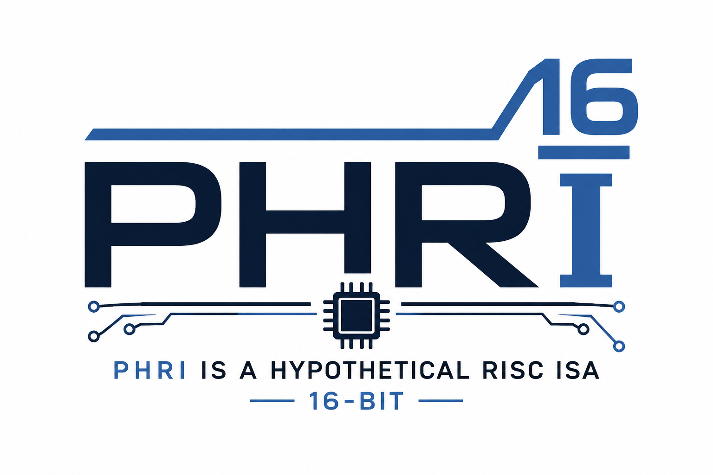

For a fun side project, what if I decided on a 16-bit data and address bus feeding a RISC-like ISA that uses a 16-bit fixed instruction size?  I'd come up with:

**PHRI:  PHRI is a Hypothetical RISC ISA**

That is pronounced like "fry" — you know, my last name.  

The [processor data sheet](docs/PHRI-Datasheet.md) contains an extensive description of the ISA.
